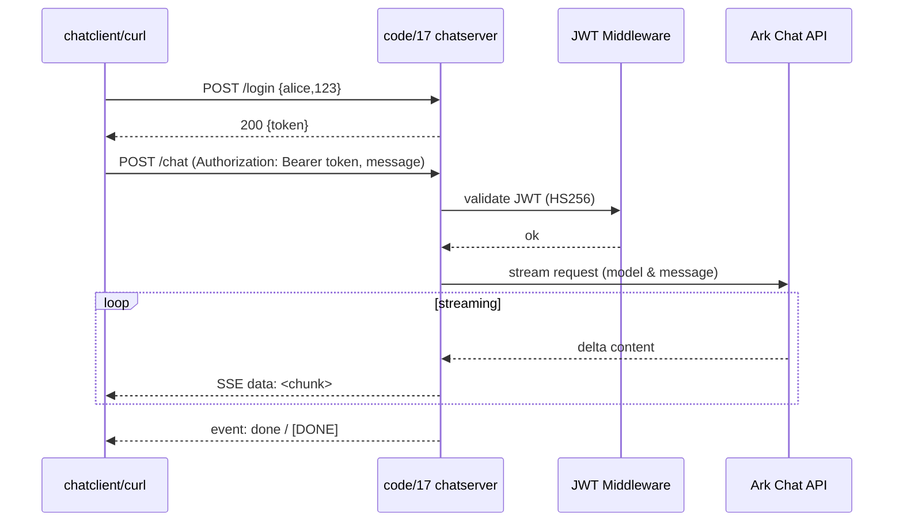

# 第15章：对话接口设计

## HTTP 设计最佳实践（参考 Google API / Stripe）
- 资源与动词：优先 RESTful 路径（`/chats/{id}/messages`），动词留给动作型操作（`/chats/{id}/close`）
- 请求/响应：使用 JSON，字段命名统一；返回标准错误结构（`type`/`code`/`message`/`request_id`），区分 4xx/5xx。
- 参考文档：
  - Google API Design Guide https://cloud.google.com/apis/design （资源命名、字段风格、错误模型、分页过滤）；
  - Stripe API Reference https://stripe.com/docs/api （幂等键、版本化、错误结构、Webhook 验证）可供对比与借鉴。
  - 或者在调用别人的API的时候，去学习他们的设计思路，比如这个课程里用到的 https://platform.openai.com/docs/overview

## HTTP 协议演进与复用
- HTTP/1.0：默认短连接，需 `Connection: keep-alive` 才复用 TCP；并发时常见队头阻塞与多连接开销。
- HTTP/1.1：持久连接为默认，支持分块传输；但单连接仍串行请求，浏览器会开多个连接提升并发。
- HTTP/2：单 TCP 内多路复用，二进制帧分片避免队头阻塞；加 Header 压缩（HPACK）与服务器推送（多被禁用）降低开销。
- HTTP/3：基于 QUIC/UDP，多路复用且单流丢包不阻塞其他流，连接迁移支持弱网/切网，常用于移动端或弱网络场景。

https://www.cnblogs.com/amulong1237/p/19147649

## HTTP 无状态与实时协作选型
- HTTP 基于请求-响应且无状态，请求间不共享会话，需要客户端携带身份凭证（Token/Cookie）或重用长连接来减少握手成本。
- Server-Sent Events（SSE）：单向、轻量，服务端推送文本流，适合聊天/日志类增量输出；浏览器原生支持，断线可自动重连。
- WebSocket：全双工、低延迟，适合实时协作/白板/游戏；需在握手时完成认证，后续消息自行定义协议与心跳。
- 长轮询（Long Polling）：客户端发请求，服务端挂起直到有事件或超时；兼容性好但连接开销大，适合作为降级方案。
- Webhook：服务端回调通知状态变化，配合请求签名验证；用于跨系统事件推送，可与上述实时通道组合使用。

| 技术 | 通信方向 | 连接模型 | 底层协议 | 实时性 | 延迟 | 数据格式 | 客户端支持 | 断线重连 | 心跳 | 认证方式 | 并发成本 | 服务端复杂度 | 典型场景 |
|---|---|---|---|---|---|---|---|---|---|---|---|---|---|
| SSE (Server-Sent Events) | 单向（Server → Client） | 长连接 | HTTP / HTTP2 | 中高 | 低 | 文本（text/event-stream） | 浏览器原生（EventSource） | 自动（Last-Event-ID） | 不需要 | Cookie / Header | 低 | 低 | 聊天流、日志、AI 流式输出 |
| WebSocket | 双向（Client ↔ Server） | 长连接（协议升级） | HTTP → WebSocket | 高 | 极低 | 文本 / 二进制 | 浏览器原生 | 需自行实现 | 必须 | 握手阶段认证 | 中 | 高 | 实时协作、白板、游戏、IM |
| 长轮询（Long Polling） | 单向（请求-响应） | 短连接（反复请求） | HTTP | 中 | 高 | 任意 | 所有客户端 | 天然重试 | 不需要 | 每次请求认证 | 高 | 中 | 兼容性方案、降级方案 |
| Webhook | 单向（Server → Server） | 短连接（事件触发） | HTTP | 低 | 高 | 任意（通常 JSON） | 服务端 | 由调用方控制 | 不需要 | 签名 / Token | 低 | 低 | 跨系统事件通知、回调 |

## 接口设计示例（参考 code/17）
- 认证：`POST /login` 固定用户（示例 alice/123），返回 JWT Bearer；`/healthz` 免鉴权，其余接口携带 `Authorization: Bearer <token>`。
- 消息发送：`POST /chat`，请求体 `{ "message": "你好", "model": "可选覆盖默认" }`；从 `Config.ModelID` 或 `ARK_MODEL_ID` 取默认模型，最后回退 `deepseek-v3-250324`。
- SSE 响应：头 `Content-Type: text/event-stream`, `Cache-Control: no-cache`, `Connection: keep-alive`；对大模型流式响应每个增量写 `data: <chunk>\n\n`，结束时写 `event: done\ndata: [DONE]\n\n`，错误写 `event: error\ndata: <err>\n\n`。
- 并发与资源：`r.Context()` + `WithTimeout` 控制 60s；`Flusher` 每次写后冲刷，`defer stream.Close()`；客户端断开/超时即退出，避免泄漏。
- 安全与头：JWT 中间件跳过 `/login`/`/healthz`；统一安全头（nosniff/CSP/deny frame）；日志与 recover 中间件。

https://www.mermaidchart.com/
